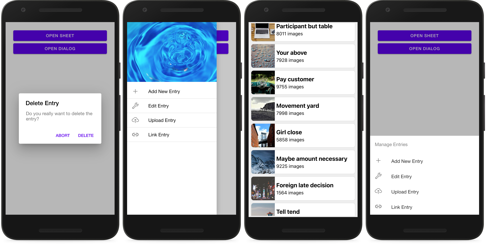
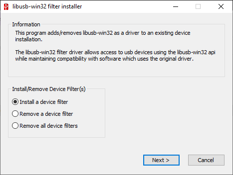
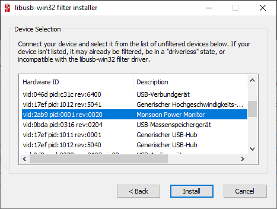

# On the Energy-Efficiency of Hybrid UI Components for Mobile Cross-Platform Development

## Setup

 - Create virtual environment: `python -m venv venv`
 - Activate virtual environment: `source venv/bin/activate` (Windows: `venv\Scripts\activate`)
 - Install external project dependencies: `pip install -r requirements.txt`
 - Add local package: `pip install -e .`

## Scripts

Several Python scripts are available to prepare the mobile devices and execute the experiment. The commands can be executed from the project's root folder, after completing the setup.

### Preparation tasks

 - Generate demo data for apps inside `./data/raw/demodata` directory: `python bin/generate_data.py`
 - Copy demo data from `./data/raw/demodata` into app projects: `python bin/copy_data.py`
 - Build and copy apps to `./data/apks` directory: `python bin/prepare_apks.py`
 - Prepare the mobile device, by installing all the apks from `./data/apks`: `python bin/prepare_device.py`
 - Start Monsoon Power Monitor: `python bin/start_monsoon.py`
 - Connect USB connected device via Wi-Fi, after Wi-Fi connection, USB can be removed: `python bin/connect_wifi.py`

### Experiment execution

Before starting the experiment execution all preparation steps have to be executed. The experiment execution script has additional parameters:

 - `-m` to set the metering approach, only `monsoon` is supported and set as default
 - `-f` define the output file, where the data should be written to, defaults to `measurements.txt`
 - `-c` define the number of executions per experimental subject, for reliable results `30` is suggested

An examplary call of the command would be as follows:

```
python bin/start_experiment.py -f ./data/experiment_run_1.txt -c 30
```

## Analysis

The data exploration and statistical analysis can be found within the notebook `./notebooks/data-analysis.ipynb`. To open the notebook, execute the following command from root folder, after completing the setup:

```
jupyter notebook
```

## UI Components



## Apps

The source code of the apps, which contain the UI components, resided inside the `./data/apps` folder.

 - `hui-android-elements`: contains `Dialog`, `Drawer`, `Sheet` implementation for Android native
 - `hui-android-scrolling`: contains `Scrolling` implementation for Android native
 - `hui-capacitor-elements`: contains `Dialog`, `Drawer`, `Sheet` implementation for Capacitor
 - `hui-capacitor-scrolling`: contains `Scrolling` implementation for Capacitor
 - `hui-elements`: contains `Dialog`, `Drawer`, `Sheet` implementation for Hybrid UI Components
 - `hui-scrolling1`: contains `Scrolling` implementation for for Hybrid UI Components, with 1 item per WebView
 - `hui-scrolling4`: contains `Scrolling` implementation for for Hybrid UI Components, with 4 items per WebView
 - `hui-scrolling10`: contains `Scrolling` implementation for for Hybrid UI Components, with 10 items per WebView
 - `instrumentation`: contains the scripts to interact with the UI components

## Results


## Monsoon Power Monitor Setup

### Windows

 1. The Power Tool with drivers can be installed as described in the [manual](http://msoon.github.io/powermonitor/PowerTool/doc/Power%20Monitor%20Manual.pdf).
 2. In order to use the Monsoon Power Monitor via the Python API a USB connection is required. On Windows a filter for the usb driver can be used, thus the lib-usb32 devel filter must be used. Download and install [libusb-win32-devel-filter-1.2.6.0.exe](https://sourceforge.net/projects/libusb-win32/files/libusb-win32-releases/1.2.6.0/). The filter can be installed for a turned on Monsoon Power Monitor according to the following screenshots:
    




### Mac M1

`libusb` might has to be installed. We faced an issue with the M1 chip architecture. The following command will install `libusb`:

 - `brew install libusb`

If the following lists USB devices, everything works as expected:

```python
import usb.core
dev = usb.core.find()
print(dev)
```

With Mac M1 an issue arose, which could be solved with the following [solution](https://github.com/pyusb/pyusb/issues/355):

 - `sudo ln -s /opt/homebrew/lib/libusb-1.0.0.dylib //usr/local/lib/libusb.dylib`
